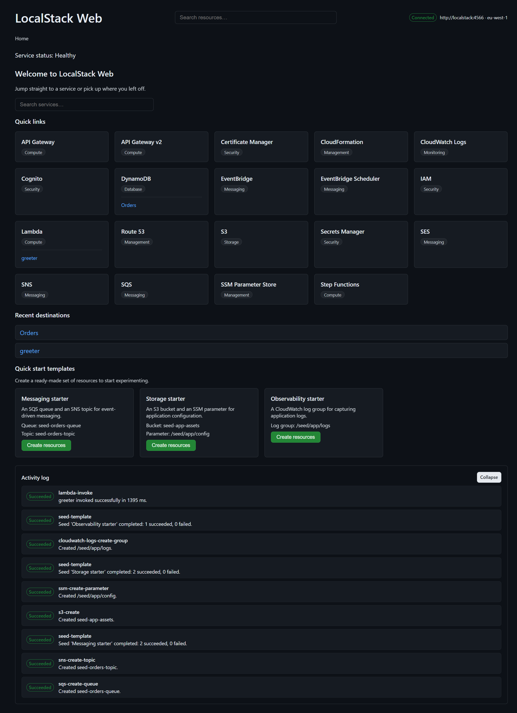
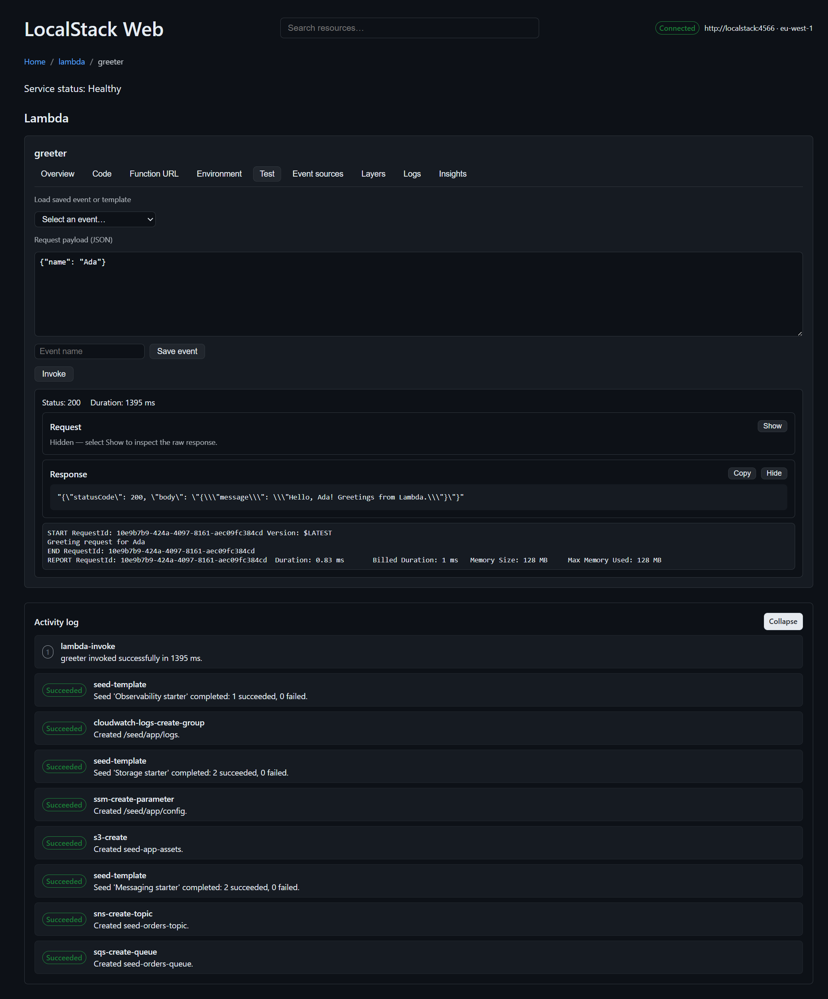
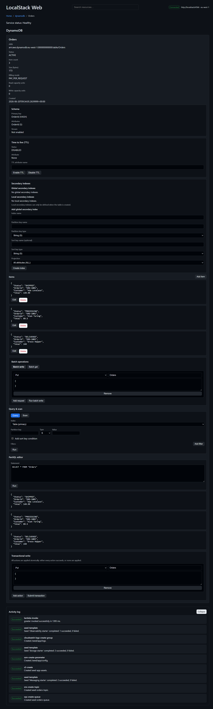
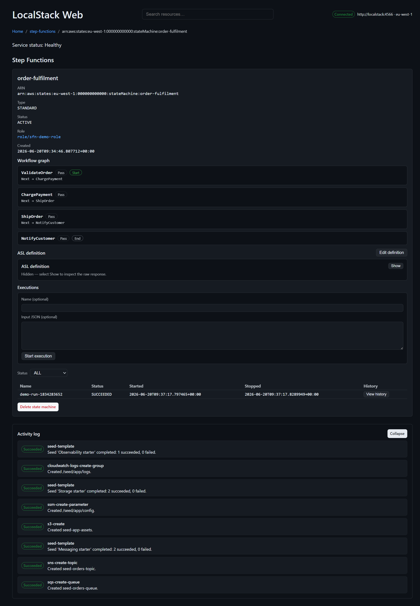
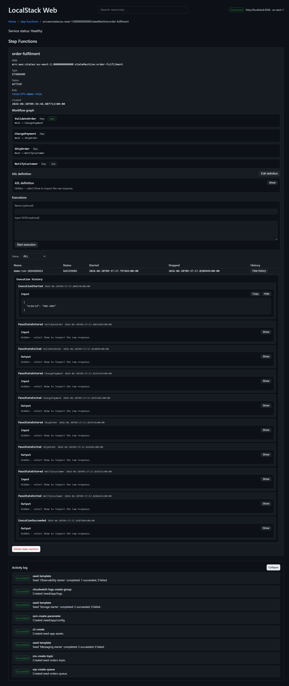

# LocalStack Web

**A fast, friendly console for the AWS services you run locally.**

If you build serverless and event-driven systems against [LocalStack](https://www.localstack.cloud/),
you already know the loop: spin up a queue, invoke a function, poke a table, then jump to a terminal
to read the logs. LocalStack Web collapses that loop into a single calm, dark-themed web app. Create
real resources, run real workflows, and see the results — including live CloudWatch logs — without
leaving the page.

It talks to LocalStack through the AWS SDK behind one configurable gateway, so the **same console also
works against real AWS** when you point it there.

> **Disclaimer:** This is an unofficial, community project. It is not affiliated with, endorsed by, or
> sponsored by LocalStack or Amazon Web Services. "LocalStack" and "AWS" and related marks belong to
> their respective owners.

## Quick Start Guide

Simple command to run LocalStack Web.
```pwsh
    docker run -d --name LocalStackWeb -p:5080:8080 ghcr.io/barrydunne/lsweb:latest
```

Advanced command to connect to LocalStack container in custom network, with personal data persistence.
```pwsh
    docker run -d --name LocalStackWeb `
        --restart unless-stopped `
        -p:5080:8080 `
        --network localstack-net `
        --env AWS_ENDPOINT_URL=http://localstack:4566 `
        --env PORT=8080 `
        --volume ${dataDir}:/data `
        --env LSW_USER_DATA_DIR=/data `
        --pull always `
        ghcr.io/barrydunne/lsweb:latest
```

## Home Page


## Why you'll like it

- **Built for the inner dev loop, not just browsing.** Invoke a Lambda from the **Test** tab and the
  full CloudWatch log stream — status, duration, and the `REPORT` line with billed duration and max
  memory — comes straight back in the response panel. No context switch, no `aws logs tail`.
- **From empty to "it works" in seconds.** One-click quick-start templates (Messaging, Storage,
  Observability) provision real resources with a clear confirmation and per-resource feedback, so a
  newcomer can have a queue, a topic, and a message in moments.
- **Detail views with real depth.** DynamoDB alone gives you TTL controls, GSI management, item CRUD,
  batch get/write, a Query/Scan builder, a working **PartiQL editor**, and transactional writes.
- **Everything stays in view.** Every list has filtering, a column chooser, and optional auto-refresh.
  Every change raises a toast *and* lands in a persistent **activity log** with success/failure badges.
  Cross-resource links are thoughtful — a Lambda's execution role links straight to IAM.
- **One product, not nineteen bolted-together screens.** Global search, breadcrumbs, keyboard
  shortcuts, a connectivity indicator, and a live notification feed are shared across the whole app.

## A quick tour

### Invoke a Lambda and read its logs in one place

Pick a saved event or a built-in template (API Gateway, S3, SQS, SNS, Scheduled), invoke, and get the
response plus the inline log stream — the highlight of the whole app.



### Work a DynamoDB table like you mean it

Inspect the schema, manage TTL and indexes, edit items, and run a PartiQL `SELECT` with results
rendered inline.



### Build and run a Step Functions workflow

Create a Standard or Express state machine, see its states as a visual workflow graph, start an
execution with input JSON, and drill into the full history timeline.



The execution history shows every transition — `ExecutionStarted`, each `PassStateEntered` /
`PassStateExited`, through to `ExecutionSucceeded` — with expandable input/output per event.



## Service coverage

The lineup is exactly what a serverless / event-driven developer reaches for locally — no filler:

| Compute | Messaging | Storage & Data | Security | Management & Ops |
| --- | --- | --- | --- | --- |
| Lambda | SQS | S3 | IAM | CloudFormation |
| Step Functions | SNS | DynamoDB | Cognito | CloudWatch Logs |
| API Gateway (v1 & v2) | EventBridge | Secrets Manager | Certificate Manager (ACM) | SSM Parameter Store |
| | EventBridge Scheduler | | | Route 53 |
| | SES | | | |

## Architecture at a glance

LocalStack Web is a **modular monolith** — one container running one process.

- **Backend** — a .NET 10 layered solution under `src/Foundation` (`Foundation.Domain`,
  `Foundation.Application`, `Foundation.Infrastructure`, `Foundation.Api`). The host assembly is
  `LocalStackWeb.dll`. It uses CQRS with a no-throw `Result<T>` flow and thin controllers, and pushes
  real-time updates over a SignalR hub at `/hub/stream`.
- **Frontend** — a React 19 + TypeScript single-page app under `src/Web`, built with Vite and themed
  with `@primer/react` (night mode). The production build is emitted to `wwwroot` and served as static
  files by the API, so the SPA and API share one origin.
- **Solution** — `src/LocalStackWeb.slnx`. Tests live under `src/tests` (`Foundation.UnitTests`,
  `Foundation.IntegrationTests`).

## Prerequisites

- [.NET 10 SDK](https://dotnet.microsoft.com/)
- [Node.js 24](https://nodejs.org/) (for the SPA)
- [Docker](https://www.docker.com/) (to build and run the container)
- A running LocalStack instance to point the console at

## Configuration

All configuration is read from environment variables; each has a built-in default, and the resolved
value (with its source) is visible on the diagnostics view.

| Variable | Purpose | Default |
| --- | --- | --- |
| `PORT` | Port the API listens on inside the process | `8080` |
| `AWS_ENDPOINT_URL` | LocalStack / AWS endpoint the gateway targets | `http://host.docker.internal:4566` |
| `AWS_REGION` | AWS region | `eu-west-1` |
| `AWS_ACCESS_KEY_ID` | AWS access key | `test` |
| `AWS_SECRET_ACCESS_KEY` | AWS secret key | `test` |
| `LSW_USER_DATA_DIR` | Directory for persisted user data (recently-viewed, favourites, saved test events). Falls back to a per-user location when unset | (host default) |
| `LSW_ALLOW_DIAGNOSTIC_REVEAL` | Set to `true` to permit revealing masked sensitive values on the diagnostics view | unset (reveal denied) |
| `Seq:Url` | Optional Seq endpoint for structured log shipping | unset (console only) |

## Build and run locally

### Backend API

```pwsh
# From the repository root
dotnet build src\LocalStackWeb.slnx -c Release
dotnet run --project src\Foundation\Foundation.Api
```

The API listens on `http://localhost:8080` (override with `PORT`). In the Development environment the
generated OpenAPI document is browsable via Swagger UI at `/swagger`.

### Frontend SPA (dev server)

```pwsh
cd src\Web
npm install
npm run dev
```

The Vite dev server runs on `http://localhost:5173` and proxies `/api` to the backend on
`http://localhost:8080`, so run the API alongside it. For a production-style run, build the SPA with
`npm run build` — the output in `src/Web/dist` is what the container serves from `wwwroot`.

## Run in Docker

The image is built from the repository root and bundles the published API with the built SPA.

```pwsh
# Build the image (tags lsweb:latest by default)
./scripts/Build-Image.ps1

# Run it, pointing at your LocalStack endpoint
./scripts/Run-Container.ps1 -HostPort 5080 -AwsEndpointUrl http://host.docker.internal:4566

# ...optionally persist user data (saved Lambda test payloads, favourites) to a host directory
./scripts/Run-Container.ps1 -UserDataPath ./.lsw-data
```

The container exposes port `8080` and defines a `HEALTHCHECK` that runs
`dotnet LocalStackWeb.dll --health-check`. When LocalStack runs as another container on a shared
Docker network, set `AWS_ENDPOINT_URL` to that container's hostname (for example
`http://localstack:4566`) and attach this container to the same network. `Run-Container.ps1` joins the
`localstack-net` network by default; pass `-NetworkName ''` to run on the default bridge and reach the
host's LocalStack via `host.docker.internal`.

## Run the tests

```pwsh
# .NET unit + integration tests
dotnet test src\LocalStackWeb.slnx -c Release

# Frontend tests (from src/Web)
cd src\Web
npm run test
```

Backend unit tests enforce 100% line/branch/method coverage; the frontend enforces 100% coverage
across all files.
